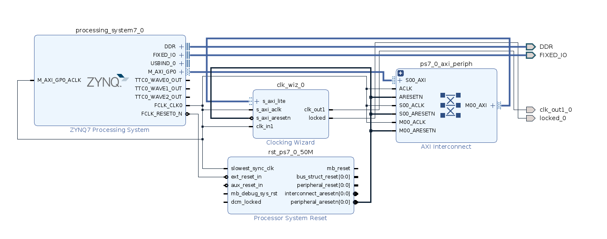

This project explains the ways in which a FPGA developer can use Xilinx Clocking Wizard and how he/she can use its custom reconfiguration feature to configure the clock within Programmable logic on runtime.

Prerequisits?
- Xilinx Vivado (2017 or later)

IPs Used:
- Zynq 7000 Verification IP
- Clocking Wizard 6.0

How to use Xilinx Clocking Wizard?

- Create a RTL project in Xilinx Vivado
- Create block design and import Zynq 7000 processing system and clocking wizard
- Configure the clocking wizard as shown in the figure 
	-- go to "clocking option" tab and click on "Dynamic Reconfig" and "Phase Duty Config" option.
        -- click on the AXI4Lite option for reconfiguration
- Generate top level wrapper
- Add simulation test bench

